# Agent.md — 乐团鸣曲 开发协作规范手册

> 项目：《乐团鸣曲》（二次同人 / Unity 6.0.38f1 / Windows / Steam 免费发布）
> 规则唯一来源：`GDD.docx` v1.3+（P0-P2 + 脑叶式完整流程，2026-09-06）
> 阅读顺序：先读本文件 → 遇到规则冲突以 **GDD v1.3+** 为准 → 有歧义先问，不要自行发明

---

## 0. 铁律（违反即返工）

1. **GDD 已定稿数值/机制不得擅改**。改动需先经人类确认并同步 GDD 版本号。
2. **所有占位/待定项（见 §14）不得私自"补全"**，只能标注、跳过或询问。
3. **合规红线**：不使用任何《BanG Dream》官方素材（立绘/音声/LOGO/乐曲）；不复制《脑叶公司》角色/美术；AI 生成素材需符合 GDD 第 7 章自查清单。
4. **数据驱动优先**：所有角色/异想体/数值/界面配置放 JSON 或 ScriptableObject，**禁止硬编码**。
5. **每次实质改动后更新本文件"变更记录"**。

---

## 1. 项目身份 & 双 AI 角色

| 项 | 值 |
|---|---|
| 类型 | 叙事驱动管理模拟 × 视觉小说（脑叶式"收容-工作-出逃-考验"框架 × BanG Dream 同人） |
| 玩家 | 旁观引导管理者（随演出被卷入的新手工作人员） |
| 引擎 | Unity 6.0.38f1（**不要降级到 2022 LTS，也不要用 Godot**） |
| 叙事 | Yarn Spinner（文本/分支）+ 自研 DialogueTrigger 状态层（触发/节点可解锁） |
| 数据 | JSON（`Data/`）+ ScriptableObject |
| 平台 | Steam (Windows)，免费、无内购无广告 |
| 首版范围 | 主线前 2 章 + 前 2 支乐队 + 2 条个人线，约 **15-20 天**可通关；完整版 ≈50 天 / 10 支乐队 |

### 本文档的两位读者

- **程序 AI（CodeBuddy/Claude 等）**：实现 §3 系统规则 + §4 数据契约 + §5 Unity 工程约定 + §10 UI 工程规范 + §13.1 自检清单
- **美术 AI（图像生成/UI 设计）**：实现 §7 视觉规范 + §8 界面参考图对照 + §13.2 自检清单

### 1.1 界面分层与部门总览（v1.3）

UI 多层结构：**L0 开始菜单**（新游戏/继续/设置/退出）→ **L1 每日编成**（选当日上场员工，右上角「开始这一天」确认后推进当天）→ **L2 逆卡巴拉生命树总览**（部门=节点、用乐队名标注、点亮解锁）→ **L3 部门场景**（2D 俯视实时管理）。

部门-节点映射：节点 1 = Poppin'Party ≈ 控制部；节点 2（Day6）= 第 2 支乐队 ≈ 情报部；后续按乐队规划依脑叶部门顺序占位。

---

## 2. 四维属性系统（已定稿，勿改）

角色四维，**初始值全部 = 10**，共用 1–120 等级刻度：

| 属性 | 颜色 | 定位 | 判定的工作 |
|---|---|---|---|
| 血量 HP | 🔴 | 归零 = 崩溃退场数日（不死亡） | 比武 |
| 精神 SP | ⚪ | 过低无法工作 | 谈话 |
| 演奏水平 | 🔵 | 成长属性 | 演奏 |
| 共感 | 🟣 | 成长属性 | 创作 |

等级分档：I:1-20 / II:21-40 / III:41-60 / IV:61-80 / V:81-100 / EX:101-120。

派遣门槛（异想体危险等级 → 判定属性最低档）：ZAYIN=无限制、TETH≥II、HE≥III、WAW≥IV、ALEPH≥V。

---

## 3. 工作系统（4 种，已定稿）

| 工作 | 判定/成长 | 消耗 | 备注 |
|---|---|---|---|
| 演奏 | 演奏水平(蓝) | 精神为主 | 情感粒子产出最多 |
| 谈话 | 精神(白) | 中等 | 解锁剧情为主 |
| 创作 | 共感(紫) | 较小 | 产出较少 |
| 比武 | 血量(红) | 较大 | 应对出逃；**显示名可随异想体而变，机制统一** |

判定伪代码：
```
基础成功率 = 异想体机制决定（数据表"工作适配/异想体修正"）
最终成功率 = min(1, 基础成功率 × (判定属性值 / 120) × 异想体修正)
成功 → 全额情感粒子 + 异想体点数；正面剧情；属性上限成长(∝消耗)
失败 → 少量情感粒子 + 少量异想体点数；负面剧情；仍成长(量较小)；按消耗扣血/精神
```

**部门场景内实时操控（脑叶式）**：选中员工 → 自由寻路 → 对异想体下达工作命令 → 工作进度条推进 → 完成时按伪代码判定 → 结果剧情/演出 → 结算。暂停/变速贯穿全程；员工血/精实时可见；出逃时指挥移动/压制。

---

## 4. 资源 = 脑叶式三层（不允许出现"羁绊点数""特殊道具"）

| 层 | 资源 | 用途 |
|---|---|---|
| 局内（当天） | 情感粒子 | 当日能源；4 种工作产出 + 异想体阈值事件；达标结束当天 |
| 局外（持久） | **星石**（=脑叶 LOB 点） | 设施升级、解锁乐队、招募员工、训练加点 |
| 贯穿 | 异想体点数 | 累积解锁异想体的情报/剧情/奖励 |

---

## 5. 角色数据结构（JSON Schema 目标形态）

```jsonc
{
  "id": "kasumi",
  "name": "户山香澄",
  "employeeType": "band",          // normal | band
  "band": "Poppin'Party",          // 普通员工为空
  "appearance": null,              // 普通员工: {hair_style, hair_color, eye_style, expression,...}；乐队少女固定原著形象
  "hp": { "current": 10, "max": 10 },
  "sp": { "current": 10, "max": 10 },
  "performance": 10,
  "empathy": 10,
  "skill": "香澄的活力：可在一次工作后恢复其他角色精神",
  "recoveryRate": 5.0,              // 每单位时间血/精恢复速度；回复室设施可提升
  "todayWorkCount": 0,             // 当日派遣次数，用于同日重复工作收益递减（不限制派遣本身）
  "unlocked_story_nodes": [],
  "personal_line_progress": 0
}
```

### 5.1 每日异想体候选池（v1.4）
- 每天开始从"异想体池"随机抽取 `[3 + 天数/3]`（向下取整，上限 5）个作为**今日候选**，以代号+特征词条呈现，玩家选 1 个收容。
- 未选中的候选**回到池中**，未来可再次出现（不是消失）。
- 已解锁异想体可重复工作，但**同日对同一异想体重复工作收益递减**。

### 5.2 剧情分级（v1.4，避免"每次工作都播剧情"）
- **日常反馈**（每次工作）：短反馈（一行台词/表情差分/小演出 ≤5 秒），不打断节奏。
- **节点剧情**（完整演出，仅关键触发）：①同一异想体工作累计第 1/3/5/10 次；②异想体点数跨档位；③特定角色组合对特定异想体工作；④章节/考验节点。
- **组合触发**：特定角色组合 + 特定异想体 = 专属隐藏互动剧情。

---

## 6. 完整流程 & 结局（v1.3，勿擅自简化）

- **天数轴**：完整版 ≈50 天/10 支乐队（每支=一章 ≈5-8 天），首版 ≈15-20 天/2 支；章内 = 收容期→加深期→考验日。
- **记忆日**：Day 5/10/15/20/25/30/35/40/45（结局日 Day50 除外）。记忆日"锚定"异想体点数/图鉴/已解锁乐队/星石/成长；此后某日失败可回滚到最近记忆日重打。
- **能源配额曲线**（仿脑叶，草案）：Day1≈300，约每 10 天 ×1.8~2.2，考验日配额上调 20-40%；最终数值待 Phase 2。
- **真/假两结局**：真结局 = Day46 前完成全部考验（归途之音被驱动 = 全部考验完成，非独立资源条件）→ Day50 真结局演出；未达标 → 玩到 Day50 以假结局收场。首版窗口占位：Day15 前完成 2 个考验。

---

## 7. 员工体系（v1.3）

- 两类：**普通员工**（可招录、无专属剧情/无个人线）与**乐队少女**（章节解锁额外员工）。
- **招录**：消耗星石生成候选（姓名/发型/发色/眼睛样式/表情/初始属性倾向随机），录用前可捏人调整外观；数量受收容室等级限制；乐队少女为原著形象不可改外观。
- **养成双轨**：星石训练（快速加点，费用随等级递增）+ 工作成长（免费但慢）；普通员工与乐队少女均可训练。

---

## 8. 异想体 / 出逃 / 考验（已定稿骨架）

- **异想体数据字段**：id/name/type/risk_level/mood/mood_danger_{min,max}/linked_character_id/work_modifiers/escape_trigger/escape_behavior/suppress_method/points_per_success/story_unlock_thresholds/background（详见 GDD 3.2 + 3.3 完整卡）。
- **出逃**：条件触发 → 出逃表现（影响设施）→ 派成员做"比武"或指定条件使其回归 → 长期未处理 = 能源流失/精神下降/连锁事件。
- **考验**：每支乐队全员参与一次大型工作/演出；任务无倒计时；唯一硬性截止点是真结局窗口（Day46）。
- **失败哲学**：剧情驱动；无永久 Game Over；血量归零=崩溃退场数日。

---

## 9. Unity 工程约定

```
乐团鸣曲/Assets/
├── Scripts/
│   ├── Systems/        GameManager(单例) / DataManager / EventManager / UIManager / WorkSystem / RecruitmentSystem / TrainingSystem / TrialSystem / SaveSystem
│   ├── Entities/       Character.cs / Aberration.cs / WorkResult.cs / Enums.cs / GameConfig.cs
│   ├── UI/             MainCanvas / CharacterSlot / AberrationPanel / ResourceBar / UIHelper
│   └── Narrative/      DialogueTrigger.cs(自研状态层) / DialogueManager.cs(Yarn封装)
├── Data/               Characters.json / Aberrations.json / Dialogues/ / GameConfig.json
├── Resources/          Art/ Audio/ Fonts/
└── Scenes/             MainMenu / Deployment / TreeOverview / Department / LoadingScene
```

- 数值配置全部走 `GameConfig.json`（成功率梯度、产出系数、星石转化率、训练费用、设施曲线、配额曲线、记忆日等占位常量集中一处）。
- 存档：`%USERPROFILE%/AppData/LocalLow/[项目名]/Saves/`（JSON；工程名确定前保留占位）。
- 目标 60fps，最低 30fps；剧情图延迟加载；工作结果提示用对象池。

---

## 10. UI 工程规范（程序 + 美术共同遵守）

- **资产路径**：`乐团鸣曲/Assets/Resources/Art/{UI|Char|BG}/<category>/<id>_<filename>.ext`，ID 与 JSON 一致。
- **UI 锚点**：UGUI Anchor + Pivot，不依赖绝对坐标。
- **状态机**：BOOT → MAIN_MENU → LOADING → DEPLOY(L1) → TREE_OVERVIEW(L2) → DEPARTMENT(L3) → BATTLE / CUTSCENE → PAUSE / SETTINGS / GLOSSARY / GAMEOVER。GameManager 单例统一调度。
- **数据驱动**：所有界面参数从 `UIConfig.json` 加载，禁止硬编码。
- **资源索引**：所有异想体/员工/部门节点通过 JSON ID 访问。

---

## 11. 美术规范

### 11.1 视觉风格总则
- 基调：低饱和度+霓辉强调色（泛黄/绿/红/橙警示）；本作主色 = **粉紫渐变+亮粉（BanG Dream 同人）+ 紫黑底**；警示仍用红/橙/绿保留紧迫感。
- 字体：中文 Noto Sans CJK SC（主）+ Source Code Pro（数据）；日文版加 Noto Sans CJK JP；英文衬线/无衬线双语版需排版校验。

### 11.2 配色键（StylePalette.json）
| 键 | 值 | 用途 |
|---|---|---|
| `primary` | #FFB7C5 亮粉 | Logo / 主按钮 / 主节点（OPEN） |
| `secondary` | #7B6CFF 紫 | 次按钮 / 高亮文字 / OPENING 脉冲 |
| `warning` | #FF3B30 红橙 | 危险警示 / 能源 <30% / 出逃 |
| `success` | #A8E10C 亮绿 | 能源 >70% / 完成提示 |
| `bg` | #1A1224 深紫黑 | 主背景 / 暗色面板 |
| `accent_text` | #FFE600 霓虹黄 | 数据/编号/标记高亮 |

### 11.3 状态配色
- 部门节点：LOCKED=暗灰、OPENING=脉冲黄、OPEN=亮粉
- 能源条：<30% 红 / 30-70% 黄 / >70% 绿

### 11.4 角色立绘
- 乐队少女 = 原著形象（BanG Dream 官方同人化），绝不混入官方未授权服饰
- 普通员工 = 可自定义（发型/发色/眼型/表情）；通过 `appearance` 字段按 ID 加载

### 11.5 禁止清单
- ❌ 官方 LOGO/官方字体/官方原声/官方人物原型
- ❌ 未授权美术/超 GDD 范围的角色
- ❌ 任何带有官方版权水印的素材

---

## 12. 脑叶界面参考图（按编号对应系统/界面）

> **使用方式**：每张图在仓库根目录，文件名如下。程序/美术对照"程序要点/美术要点"两列同时实现，并打勾 §13 自检 Checklist。
> 美术 AI 必须严格按图中视觉风格产线稿；程序 AI 必须按图实现交互/状态。

### F1 — 开始菜单 / Main Menu
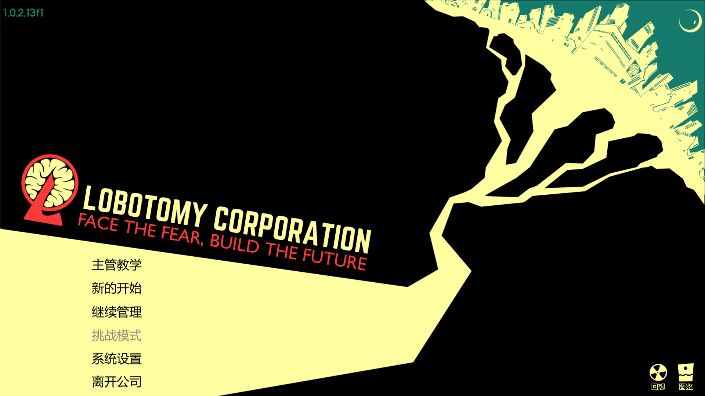
- 脑叶：主管教学/新的开始/继续管理/挑战模式/系统设置/离开公司
- 本作：L0 主菜单（新游戏 / 继续游戏 / 设置 / 退出游戏）
- **程序要点**：4 入口按钮；新游戏→L1 编成；继续→读档→最近记忆日 L1；设置→L0 设置面板；ESC=退出确认
- **美术要点**：暗色背景+霓虹辉光；左上 Logo（Ring 公司树标替换脑叶的 L-Corp 标志）+ 菜单项左对齐；版本号右下角；右上"LOBOTOMY CORPORATION"标语位可替换为本作副标题

### F2 — 加载图 / Loading
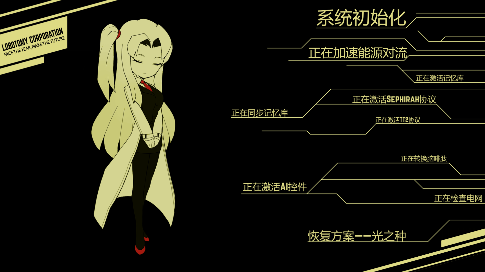
- 脑叶：主管就位图+多行滚动系统初始化文字
- 本作：启动/初始化 Loading 界面
- **程序要点**：异步加载（Data/Textures/Audio/Scenes）+ 进度百分比；ESC=跳过（若允许）
- **美术要点**：左侧角色立绘（普通员工或乐队少女，待定）+ 右侧多行滚动"正在 X"动态文字；底部带宽斜线

### F3 — 系统设置 / Settings
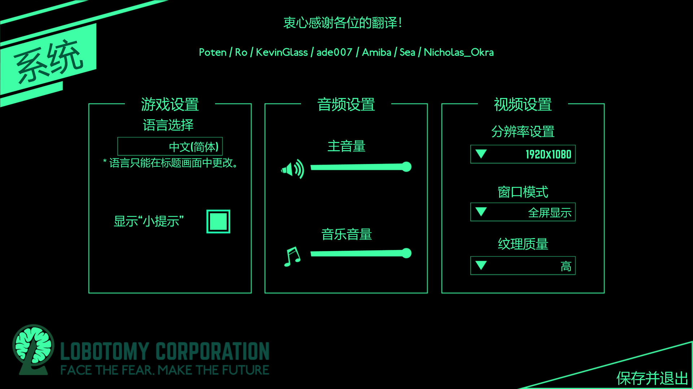
- 脑叶：三栏（游戏设置/音频设置/视频设置）
- 本作：L0 设置面板（语言、音效、字幕、画面）
- **程序要点**：三栏卡片；语言/字幕开关/主音量/音乐音量/分辨率下拉/窗口模式（全屏/无边框/窗口）/纹理质量（低中高）；保存并退出
- **美术要点**：绿色霓虹主题（与暂停界面统一）；三栏卡片边框+滑块+下拉样式

### F4 — 初始开放的部门及下批预览 / Department Tree Overview (Initial)
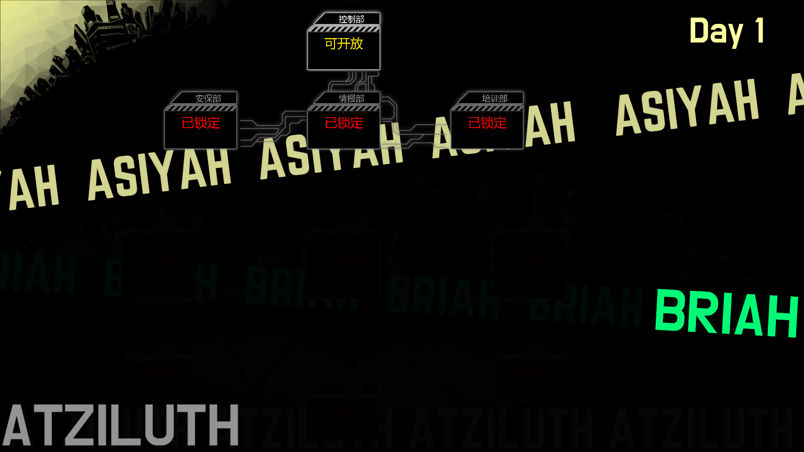
- 脑叶：生命树节点，控制部可开放，安保·情报·培训已锁定
- 本作：L2 逆卡巴拉生命树总览（首次进入，Day 1 仅 1 节点可开放）
- **程序要点**：节点状态 enum（LOCKED/OPENING/OPEN）；锁定节点点击=显示解锁条件；OPEN 节点点击进入 L3；预览下批节点显示但不可点
- **美术要点**：Sephirot 文字背景层+节点方框；锁定=暗红/灰、已开放=亮黄/粉；OPENING 临时状态=脉冲波纹；连线表示解锁关系

### F5 — 选择部门开放时 / Department Unlock Dialog
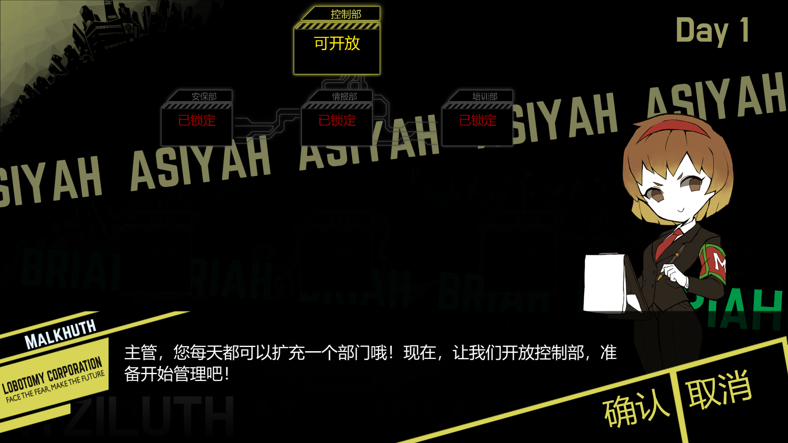
- 脑叶：Malkuth 主持"开放控制部"确认
- 本作：部门解锁确认弹窗（Bandori 角色立绘+对话）
- **程序要点**：弹窗中显示角色立绘 ID + 对话文本（Yarn 节点）；确认按钮=解锁当前节点+触发对应剧情；取消=不操作
- **美术要点**：双线红边框警示条；底部斜向对话框；立绘右侧、确认/取消按钮右下角倾斜条；LOBBOTOMY 字样保留作为系列感标识

### F6 — 异想体选择 / Aberration Selection
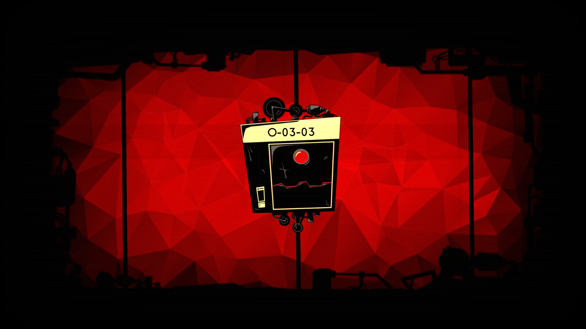
- 脑叶：O-03-03 单元（深红机械装置+心脏血袋）
- 本作：L1 异想体选择/收容单元详情
- **程序要点**：异想体 ID/危险等级/情绪值/心电图/工作偏好/镇压方式；左下"派遣员工工作"按钮=进入 F8 工作选择
- **美术要点**：异想体专属血袋+机械骨架；背景色按危险等级渐深（ZAYIN 浅、TETH 棕、HE 红、WAW 深紫、ALEPH 黑）；每个异想体一个独立单元造型

### F7 — 鼠标悬浮至异想体 / Aberration Hover Tooltip
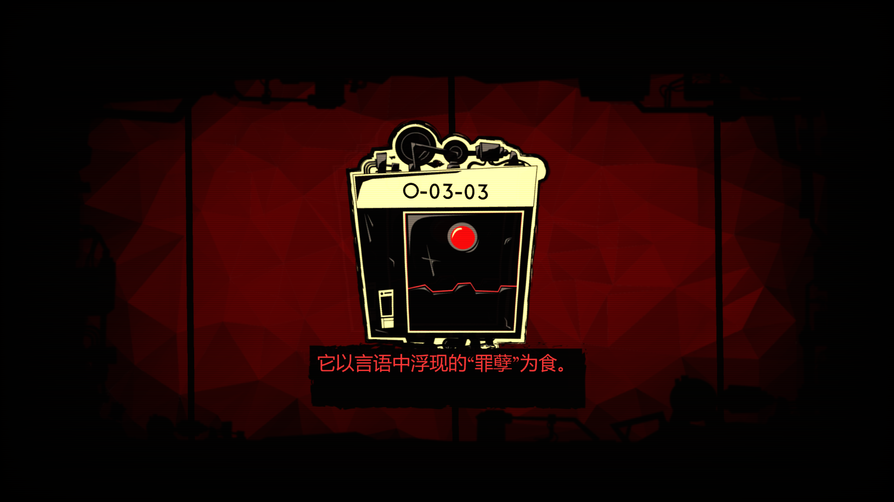
- 脑叶：异想体单元+底部红色 tooltip
- 本作：异想体悬停 tooltip
- **程序要点**：鼠标移上异想体=显示一句话来历/特质；不挡操作；离开后消失
- **美术要点**：异想体单元缩小至中央；底部红色横幅显示 tooltip 文字（黑底白字+红色描边）

### F8 — 点击异想体触发工作选择 / Work Selection
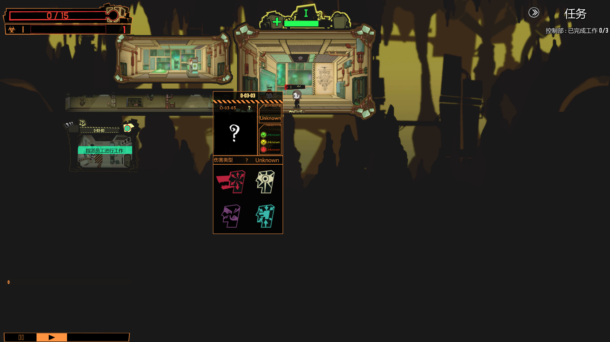
- 脑叶：部门场景+异想体面板+本能/洞察/沟通/压迫 4 工作格
- 本作：L3 部门场景内点击异想体→工作弹窗
- **程序要点**：4 种工作按钮（颜色对应：演奏=蓝、谈话=白、创作=紫、比武=红）；下方拖拽员工头像到工作格即派遣；左下"派遣员工工作"按钮确认；显示每个员工的判定成功率与当前血/精
- **美术要点**：异想体面板居中弹出；4 个衬衣 icon 颜色=工作色；左下角黄边按钮

### F9 — 正式开始的游戏内界面 / Department Scene (Main Gameplay)
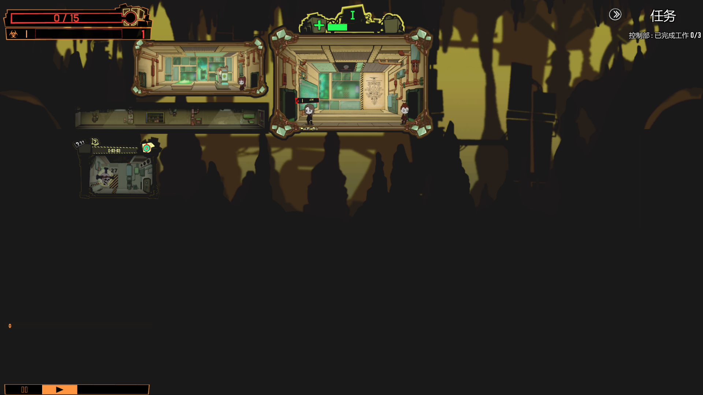
- 脑叶：控制部场景+左上能源/右上任务/底部时间条
- 本作：L3 部门场景主界面（2D 俯视）
- **程序要点**：实时操控（选员工→寻路→下达工作→进度条→判定→结算）；左上能源条+危险/警示；右上任务+Day N+完成进度；底部时间条=能源达标进度；左下速度控制（暂停/1x/2x）
- **美术要点**：像素/2D 俯视场景（不规则地形+绿色机械舱壁）；能量条红色、黄/绿警示；任务窗口（白色斜边框）；时间条（绿色横条）；员工 sprites 在走廊内移动

### F10 — 暂停界面 / Pause Menu
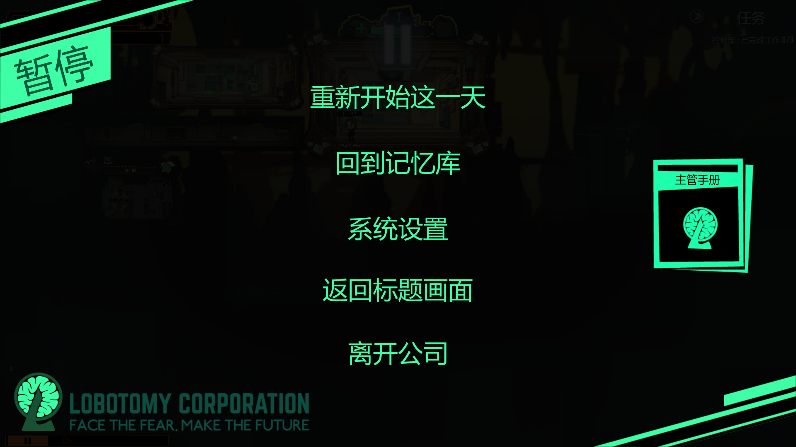
- 脑叶：暂停——重新开始这一天/回到记忆库/系统设置/返回标题画面/离开公司
- 本作：L3 暂停菜单
- **程序要点**：暂停时游戏循环冻结；5 项菜单（其中"重新开始这一天"=回到本日编成 L1；"回到记忆库"=跳到最近记忆日 L1；"系统设置"=打开设置面板；"返回标题画面"=回 L0；"离开公司"=确认退出）
- **美术要点**：大字体青绿色文字居中；左上"暂停"标题块；右下"主管手册" icon（Ring 树标替换）；底部 LOGO+副标题

### F11 — 每一天的剧情界面 / Daily Story Scene
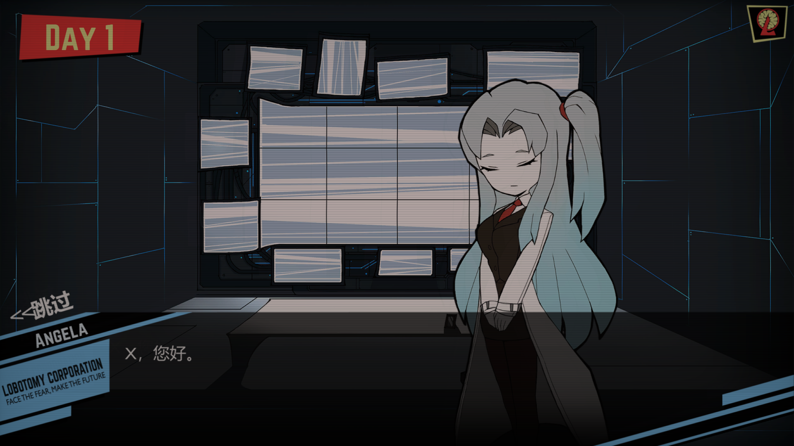
- 脑叶：Day 1 + Angela 立绘 + 对话
- 本作：L1 后序章/每日剧情（序章）
- **程序要点**：角色立绘 ID + 对话框（Yarn 节点）；左上 DAY X 标签；左下"跳过"按钮（仅当剧本完成时可用）
- **美术要点**：角色立绘（原作形象）+ 高科技感背景（扫描线+蓝色几何线）；DAY X 红底白字斜角标签；左下"LOBOTOMY CORPORATION"副标题位+创作者署名

### F12 — 剧情触发选项时 / Story Choice
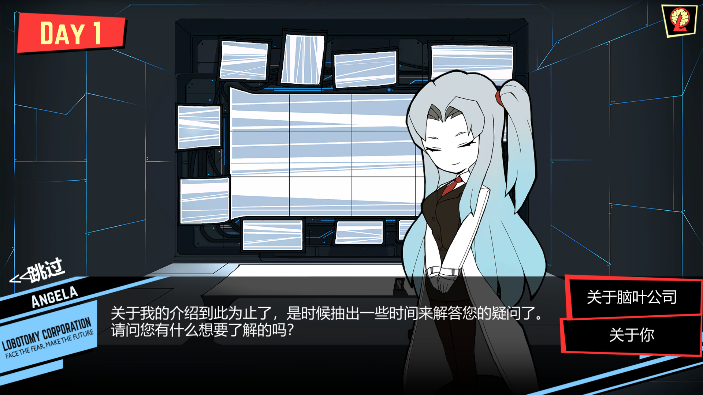
- 脑叶：Angela 立绘 + 对话 + 两个选项按钮
- 本作：剧情分支选择
- **程序要点**：Yarn 节点触发选项；选项 ID 与跳转节点；"跳过"按钮；选项最多 3 个
- **美术要点**：选项按钮红色双线边框；右侧选项框（最多 3 选项纵向排列）；对话角色立绘保持 F11 同款风格

### F13 — 每个异想体的图鉴 / Aberration Codex
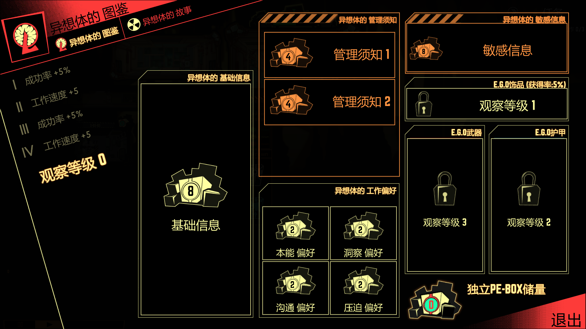
- 脑叶：侧栏（成功率/工作速度/观察等级）+ 基础信息+管理须知+敏感信息+E.G.O 饰品/武器/护甲
- 本作：L4 图鉴——异想体详情
- **程序要点**：异想体详情（基础信息/工作偏好/E.G.O/PE-BOX）；观察等级阈值解锁对应信息；左滑栏显示工作偏好；右下"独立 PE-BOX 储量"
- **美术要点**：斜向胶带式侧栏；齿轮等级徽章（I~EX 颜色随等级：I 浅灰→EX 黑金）；信息卡片橙色边框；右下 PE-BOX 用绿色徽章

### F14 — 图鉴里的故事页面 / Codex Story Page
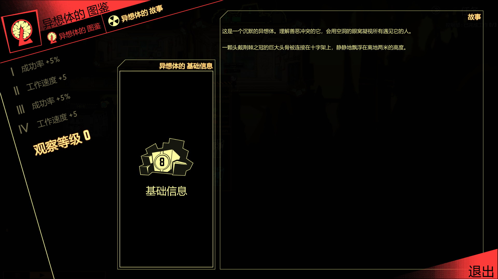
- 脑叶：图鉴切到"故事"标签+文字描述
- 本作：L4 图鉴——故事模式
- **程序要点**：异想体背景故事文字（Yarn 节点或 JSON 字段）；与图鉴同侧栏
- **美术要点**：右侧故事卡片黑色背景+打字机字体（中文用思源黑等宽替代）

---

## 13. 双 AI 自检 Checklist（每次交付必须逐条打勾）

### 13.1 程序 AI 自检
- [ ] 实现了 F1-F14 中对应的全部界面/交互/状态迁移
- [ ] 所有界面元素由 `UIConfig.json` 驱动，无硬编码
- [ ] 资源按 ID 加载，资产路径不写死在脚本里
- [ ] 暂停/记忆日/部门切换等状态切换正确无副作用
- [ ] Yarn 剧情节点接入正确、变量与 GDD 字段一致
- [ ] 满足 GDD v1.3+ 四维/资源/天数/考验/结局等已定稿规则（§0 铁律）
- [ ] 每次提交前 `git status` 干净、`docx save_file` 已落盘

### 13.2 美术 AI 自检
- [ ] 配色、字体、栅格与 `StylePalette.json` 一致
- [ ] 节点/状态/警示色等语义化配色与 §11.3 一一对应
- [ ] 角色立绘/UI 素材符合 GDD 合规要求（不混入官方素材与未授权角色）
- [ ] 所有视觉素材按 §10/§11.4 命名规范存放，可被程序通过 ID 加载
- [ ] 视觉稿对照 F1-F14 各项复核，不偏离整体风格
- [ ] 各分辨率（1080p 起点）+ 多语言版本（中日英）排版无破版
- [ ] 与程序约定一致的 UI 锚点/资产预留位置（面板 9-slice、按钮 hitbox）
- [ ] 引用了 GDD 第 7 章的合规要求（参考图重用不混淆官方）

---

## 14. 待定项（AI 不得私自决定，先问）

| 待定项 | 状态 | 何时定 |
|---|---|---|
| 工程与存档目录名 `[项目名]` | 占位 | Phase 1 工程名确定后 |
| 主线完整章节数 | v1.3 已定（完整版 ≈50 天 / 10 乐队） | — |
| 完整版 10 支乐队名单 | 已定 Poppin'Party → 梦限大 MewType；中段顺序待列 | Alpha 前 |
| 四维成长数值 | 公式占位系数 | Phase 2 |
| 各设施升级数值 | 星石消耗量仅定性 | Phase 2 |
| UI 线框图（开始菜单/每日编成/生命树/部门场景四套） | 3.1 已定分层，尚未绘制 | Phase 2 前 |
| 部门场景布局与寻路方案 | 3.1-L3 参考脑叶，细节待定 | Phase 2 前 |
| 能源配额曲线 | 3.12 数值草案 | Phase 2 |
| 结局演出内容/各结局奖励 | 2.3 仅给方向 | Phase 3 |
| 本地化语言范围 | 未定（首版建议中英） | 上线前 |
| 普通员工招录数值/成长倾向 | 已定星石招录+可捏人 | — |
| 捏人外观预设库 + 星石训练费用曲线 | 外观维度/预设数、训练费用（占位 I 级10→EX 级数千） | Phase 2 |

---

## 15. 开发顺序（当前目标：完成 Phase 0 → 进入 Phase 1）

1. **Phase 0**（2-4 周）：L0 主菜单 + 加载图 + 系统设置（L1+L2+L3 框架）；JSON 加载 Demo；占位 UI
2. **Phase 1**（2 周）：数据层完备（角色/异想体/GameConfig JSON）+ 存档骨架（记忆日锚定）+ 招录/训练
3. Phase 2：日循环 + 生命树总览 + 部门场景 + 实时操控
4. Phase 3：Yarn 接入前 2 章 + 个人线
5. Phase 4/5：打磨、Steam 页与合规（发布时间按"开发完成+6 周"倒排）

---

## 变更记录

| 日期 | 版本 | 说明 |
|---|---|---|
| 2026-09-06 | v1.3 | 同步 GDD v1.3：员工体系（普通员工+乐队少女）、完整流程天数轴、记忆日、真/假结局（Day46 窗口）、能源配额曲线草案 |
| 2026-09-06 | v1.3 | 补充普通员工招录/捏人（外观字段）与星石训练加点双轨养成 |
| 2026-09-06 | v1.3 | UI 分层定稿：L0-L3 界面结构；工作改为部门场景内脑叶式实时操控 |
| 2026-09-06 | v2.0 | 全面重写为程序+美术双 AI 自检手册：嵌入 15 张脑叶界面参考图（F1-F14，含脑叶→本作系统/界面/程序要点/美术要点）；§11 美术规范与配色键；§13 双 AI 自检 Checklist；§14 待定项；与 GDD v1.3+ §3.13 视觉规范对齐 |
| 2026-09-07 | v2.1 | 参照外部评审建议做设计校验修订（不盲从）：新增 §5.1 异想体候选池机制、§5.2 剧情分级；角色 Schema 加 recoveryRate/todayWorkCount；**明确拒绝**"角色/剧情永久锁死"与"限制同角色同日多次工作"（违背无永久损失原则与脑叶可重复工作设计）；同步 GDD v1.4 |
| 2026-09-06 | v2.0 | v2.0 程序侧落地（F1-F14 全要点，仅框架无美术）：① §10 状态机——GameState 枚举（BOOT→MAIN_MENU→LOADING→DEPLOY→TREE_OVERVIEW→DEPARTMENT→BATTLE/CUTSCENE→PAUSE/SETTINGS/GLOSSARY/GAMEOVER），UIManager 重写支持覆盖态+全局 ESC（主菜单=退出确认/部门=暂停/加载=跳过/覆盖态=返回），GameManager 统一调度（LoadAll 后 BOOT→LOADING）；② UIConfig.json + StylePalette.json——palette/工作色/节点色/能源阈值/参考分辨率/速度档名/加载步骤/移动速度/日志行数全部数据驱动；③ F2 LoadingScreen（步骤滚动+百分比+ESC 跳过）；F3 SettingsScreen 三栏（语言/字幕/主音量/音乐音量/分辨率/窗口模式/纹理质量 + SettingsSystem 持久化 settings.json）；F1 主菜单左对齐+版本号+ESC 退出确认；④ F4/F5 生命树三态（LOCKED/OPENING/OPEN）+解锁确认弹窗（确认=UnlockDepartment+触发 unlock_node_{n} 剧情）+ unlocked_nodes 存档持久化；⑤ F6 编成屏异想体详情+「派遣员工工作」；F7 悬停 tooltip（background 一句话来历，raycast 关闭不挡操作）；F8 工作弹窗（4 工作按 UIConfig 配色+EstimateSuccessRate 成功率+血精+派遣确认）；F9 L3 底部能源时间条（EnergyColor <30%红/30-70%黄/>70%绿）+速度档按 UIConfig；F10 PauseScreen 5 项（重开本日/回记忆库/设置/回标题/离开公司）+timeScale 冻结恢复；⑥ F13/F14 CodexScreen 图鉴（信息/故事标签，观察等级=异想体点数跨 story_unlock_thresholds 档数，PE-BOX=点数）；F11/F12 CutsceneScreen 占位（DAY X/立绘占位/对话/选项≤3/跳过，DialogueManager 驱动）；⑦ 无开放部门时编成确认自动引导 L2 解锁。BATTLE/GAMEOVER 状态已注册预留。依据：agent.md v2.0 §10/F1-F14/§13.1。 |